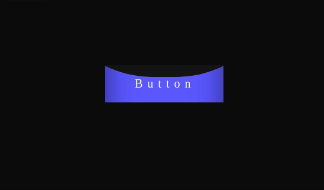

#### Liquid Button HTML + CSS

Feel free to use the code shared here, improvements and criticisms are always accepted.

Simple button with liquid effect, can be reproduced in react, vue, angular and other frameworks for frontend easily

